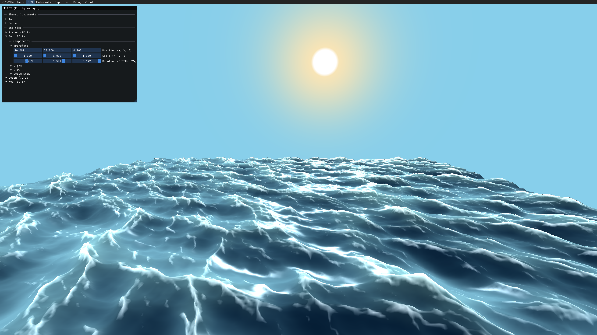

# Cydonia - *Experimental Engine*

I'm just messing around.

*Note: I am using this repo as a way to learn rendering algorithms and game engine architecture. This is not meant to be used in any professional capacity.*

## Entity Component System (ECS) Architecture
Cydonia is built on a data-oriented architecture called ECS. In this pattern, components are raw data. This design is said to be data-oriented because data transformation, done through the use of systems, is done in linear memory. These components are allocated from pools which is how this memory is linear. In an ideal implementation, there is one pool per archetype (combination of components). This is because systems iterate over entities that have a specific archetypes and not over components. In the current Cydonia implementation however, there is one pool per component. Most of the implementation stands on top of template metaprogramming, which might not be ideal for compile times. Here are a few examples of components:

* `RenderableComponent`: Basic properties like visibility or shadow casting/receiving. Also contains some buffers containing instancing and tessellation data
* `ViewComponent:` Signals that this entity should have a scene view. For example, a player or a light that needs shadow mapping.
* `TransformComponent`: Position, scaling and rotation data.
* `MeshComponent`: A handle to mesh data from the mesh cache
* `TessellatedComponent`: An entity with a mesh can be dynamically tessellated using this component, effectively giving us very granular control over its LOD.
* `InstancedComponent`: Signals that this entity contains instanced rendering and how many instances. Right now, each instance's position is randomly generated.
* `MaterialComponent`: Defines the pipeline and textures that will be used for rendering

There are also `SharedComponents` which are basically singleton components that do not need multiple instances, i.e. they are not attached to one entity. Here are a few examples:

* `InputComponent`: Is responsible to track keyboard and mouse inputs to the application. Also manages window resizing.
* `SceneComponent`: Contains scene camera and light information. A bit of a catch all for things that don't fit or are not accessible anywhere else.

## FFT Ocean using Compute
Using the `FFTOceanComponent` and the `FFTOceanSystem` along with the `OceanRenderSystem`, it is possible to render a patch of 3D-displaced ocean water. There are several parameters available to control the amplitude and direction of the waves along different kinds of resolution. This is an implementation of Tessendorf's "Simulating Ocean Water" paper [2] using Compute [1]. Some minor optimizations were achieved, mainly in the shader code and texture usage, and modifications were done to work within Cydonia's coordinate system. The foam factor was calculated based on the Jacobian determinant [2] at every texel. This was done using finite differences. 

The water rendering itself is done mixing refracted vs reflected diffuse color based on a fake fresnel. Then, adding the foam and specular lighting. Subsurface scattering (SSS) was faked by assigning a lighter color the higher the wave was, assuming that higher waves meant it was thinner. This was then multiplied by the dot product of the light direction and the view direction.

Using the `TessellatedComponent`, you can dynamically tessellate the ocean grid.

#### To do
* Screen-space or planar reflections
* More physically based rendering
* "Infinite" tiled ocean

_References:_

[1] Flügge, F. (2017). Realtime GPGPU FFT Ocean Water Simulation [Research Project Thesis, Hamburg
University of Technology]. https://doi.org/10.15480/882.1436

[2] Tessendorf, J. (2004). Simulating Ocean Water.

## Procedurally Generated Terrain
Using the `ProceduralDisplacementComponent`, it is possible to use real-time compute-generated noise to displace meshes. Currently, white noise, simplex noise, voronoi noise and a form of domain-warped noise are implemented. Simplex, voronoi and domain-warped noise all take advantage of fractional brownian motion (FBM) therefore allowing multiple octaves of noise to modulate each other. Most desirable parameters like amplitude, gain, frequency and lacunarity are customizable.

Normals are generated in a sort of Sobel fashion by sampling heights above, below, to the left and to the right of the current texel. Then we create two direction vectors and do the cross product.

I don't think this is ideal as there are artifacts, especially when changing tessellation level since this is done in the tessellation evaluation shader. There is almost certainly a better way to do this by directly using the noise function that was used to generate the heightmap in the first place, effectively giving a full per-pixel resolution instead of using the fixed heightmap resolution. This could lead to performance issues though as some noise functions using multiple octaves can be expensive to compute.

#### To do
* "Infinite" seemless tiling

_References:_

https://www.redblobgames.com/maps/terrain-from-noise/

https://thebookofshaders.com/12/

https://thebookofshaders.com/13/

https://iquilezles.org/articles/warp/

## Shadow Mapping with PCF
There is a flag in the `RenderableComponent` to signal whether a renderable is shadow casting and/or receiving. If it is casting, it will be rendered using the `ShadowMapSystem`. The terrain fragment shader samples the shadow map using percentage-closer filtering (PCF).

## Fog Post-Processing Pass using Compute
I wanted to find out if a post-processing fog pass would be possible using compute. This is done using the `FogComponent` and the `FogSystem`. Using the framebuffer's depth and the appropriate inverse matrices, we can reconstruct the world position of a pixel and apply fog to it using rudimentary raymarching. Currently, height fog, sun fog and distance fog are implemented. There is also a rudimental sun drawn in the sky during that pass.

#### To do
* Some fBm noise could be applied to have a rolling fog effect over time

## Graphics Rendering Interface Subsystem (GRIS)
Basically just a rendering interface that can be implemented using different rendering APIs. Currently, Vulkan is my priority and is the only one fully implemented. Here are some notable features:
* Dynamically reload shaders for fast iteration times
* API resources are pool-allocated
* Some resources like command lists, buffers and textures are passed around as handles for safety and lightness
* Data-oriented pipeline and material descriptions in JSON
* A "render graph" where render pass order is explicitly described and command lists are chained together

#### To do
* D3D12 and/or Metal backend
